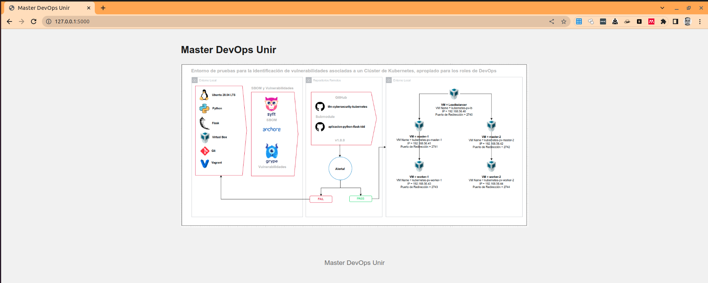

<div align="center"> 
  <h1>Aplicación Python Flask TDD o Test-Driven Development (desarrollo dirigido por tests)</h1>
</div>


## Creación

El skeleton base para un servicio web en python, teniendo como micro-framework web Flask.


## Contents

- [Creación](#creación)
- [Contents](#contents)
- [Requiremientos](#requiremientos)
- [Download Python](#download-python)
- [Instalación del proyecto](#instalación-del-proyecto)
- [Variables de entorno](#variables-de-entorno)
- [Estructura del proyecto](#estructura-del-proyecto)
- [Funcionamiento del TDD Test-Driven Development](#funcionamiento-del-tdd-test-driven-development)
- [Validación de la funcionalidad](#validación-de-la-funcionalidad)

## Requiremientos

Este servicio utiliza los siguientes requerimientos:

1. Python v3.10.4
1. Flask v0.1 (Inicialmente para encontrar vulnerabilidades)
1. Flask-SQLAlchemy v2.5.1
1. Gunicorn v20.1.0
1. Psycopg2 v2.9.3
1. Flake8 v4.0.1
1. Black v22.3.0
1. pytest v7.1.2

## Download Python

Antes de comenzar, asegúrese de tener instalada la última versión de [Python 3.9](https://www.python.org/downloads/release/python-390/), que puede descargar desde [http://www.python.org/download/](http://www.python.org/download/).

> This template uses Python v3.10.4.

## Instalación del proyecto

Clona el repositorio.

```sh
$ git clone https://github.com/PetterVargas/aplicacion-python-flask-tdd
$ cd aplicacion-python-flask-tdd
```

Cree y active el entorno virtual.

```sh
$ python3.10 -m venv venv
$ source env/bin/activate
(env)$
```

Instalar requerimientos:
```
(env)$ pip install -r requirements.txt
```

## Variables de entorno

En un archivo en el directorio raíz del proyecto creamos el archivo `.env` y agregamos las siguientes variables de entorno:

```
FLASK_APP=project/app.py
FLASK_ENV=development
```

o

```sh
export FLASK_APP=project/app.py
export FLASK_ENV=development
```


## Estructura del proyecto

```sh
├── project
│   ├── __init__.py
│   ├── app.py
└── tests
    ├── __init__.py
    └── app_test.py
```

## Funcionamiento del TDD Test-Driven Development

Abra el archivo *tests/app_test.py* con su editor favorito -- es bueno [Visual Studio Code](https://code.visualstudio.com/) y agrega el siguente código

```python
from project.app import app


def test_index():
    tester = app.test_client()
    response = tester.get("/", content_type="html/text")

    assert response.status_code == 200
    assert response.data == b"Master DevOps Unir"
```

Primero estamos creando los test de la aplicación, y su ejecutamos las pruebas debe darnos error, ya que el hola mundo no está disponible.

Ejecuta los test:

```sh
(env)$ python -m pytest
```

Si todo está bien los test deben fallar.

```sh
ImportError: cannot import name 'app' from 'project.app
```

Ahora agreguemos el código nuestra app *project/app.py*:

```python
from flask import Flask


# Creación e inicialización de la aplicación de Flask
app = Flask(__name__)


@app.route("/")
def hello():
    return "Master DevOps Unir"


if __name__ == "__main__":
    app.run()
```

Arranquemos la aplicación:

```sh
(env)$ FLASK_APP=project/app.py python -m flask run
```

En el navegador [http://localhost:5000/](http://localhost:5000/) ya debemos ver el Hola Mundo!

Volvamos a ejecutar los test, ya deberían pasar.

```sh
(env)$ python -m pytest

=============================== test session starts ===============================
platform darwin -- Python 3.10.4, pytest-7.1.2, pluggy-1.0.0
rootdir: /home/peter/Documents/University/aplicacion-python-flask-tdd
collected 1 item

tests/app_test.py .                                                         [100%]

================================ 1 passed in 0.10s ================================
```

## Validación de la funcionalidad

Muestra gráfica de la funcionalidad y lo que muestra la aplicación.


